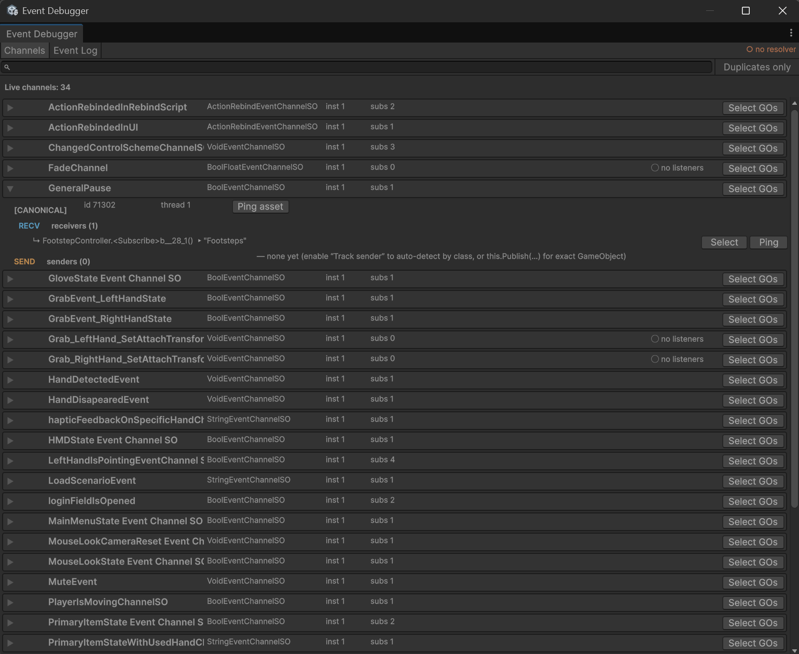
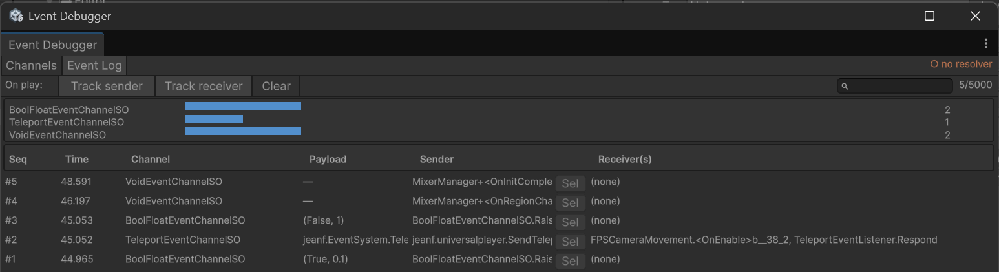

# Event System

A lightweight event system that uses **ScriptableObject channels** as the communication medium, so your classes can talk to each other without holding direct references.

Think of it like radio: a publisher *broadcasts* on a channel, and anyone interested *tunes in* to that channel. The publisher doesn't know who is listening, and the listeners don't know who is broadcasting. This removes hard dependencies between systems — but it can also make the flow of information hard to follow, which is exactly what the built‑in [Event System Debugger](#event-system-debugger) is for.

---

## Installation

Add the scoped registry to Unity's `ProjectSettings`:

1. In `Project Settings ▸ Package Manager`, click the **(+)** to add a new scoped registry.
2. Set the following parameters:
   - **name:** `jeanf`
   - **url:** `https://registry.npmjs.com`
   - **scope:** `fr.jeanf`
3. Open the **Package Manager**, switch to **My Registries**, and install **Event System**.

---

## Core concepts

### Channels
A channel is a ScriptableObject asset you create from the `Assets ▸ Create ▸ Events` menu (e.g. *Bool Event Channel*, *Void Event Channel*, *String Event Channel*…). It exposes a `RaiseEvent(...)` method to broadcast and an `OnEventRaised` event to subscribe to.

### Listening (receiver)
Subscribe to a channel's `OnEventRaised` event, typically in `OnEnable`, and unsubscribe in `OnDisable`:

```csharp
using jeanf.EventSystem;
using UnityEngine;

public class DoorSound : MonoBehaviour
{
    [SerializeField] private BoolEventChannelSO doorOpenChannel;

    void OnEnable()  => doorOpenChannel.OnEventRaised += OnDoor;
    void OnDisable() => doorOpenChannel.OnEventRaised -= OnDoor;

    void OnDoor(bool open) { /* react */ }
}
```

You can also drop a ready‑made `*EventListener` component (e.g. `BoolEventListener`) onto a GameObject and wire the response from the Inspector.

### Broadcasting (sender)
Anywhere you need to publish, call `RaiseEvent` on the channel:

```csharp
[SerializeField] private BoolEventChannelSO doorOpenChannel;

void Open() => doorOpenChannel.RaiseEvent(true);
```

The package also ships `*EventSender` components for the common types.

### Canonical channel resolution (Addressables)
When the same channel asset is loaded through Addressables, it can be deserialized into **several runtime instances** — a publisher on one duplicate and a listener on another would never meet. Channels route every subscribe/raise through `CanonicalChannelResolver`, which redirects all operations to a single *canonical* instance. If no resolver is installed (plain editor play, standalone use), channels behave exactly as before.

---

## Event System Debugger

A built‑in editor window to see what your events are actually doing at runtime: which channels are alive, who listens, who sends, in what order events fire, and whether Addressables has split a channel into duplicates.

Open it from **`Window ▸ jeanf ▸ Event System Debugger`**, then enter Play mode.

> The debugger is compiled only in the editor and in **development builds** (`DEVELOPMENT_BUILD`); it is stripped entirely from release builds, so there is no runtime overhead in shipping.

### Channels tab



Lists every live channel. For each one you can see:

- **inst / DUPLICATE** — how many live runtime instances share the asset. More than one means Addressables duplicated it; the expanded view marks which instance is `[CANONICAL]`.
- **instance id & thread** — the Unity instance id and the thread the instance was first seen on (flagged ⚠ if off the main thread).
- **🟦 RECV — receivers** — every listener currently subscribed, with its declaring type, method, and GameObject. Each has **Select** / **Ping** buttons, and **Select GOs** selects them all in the Hierarchy.
- **🟧 SEND — senders** — who publishes on the channel (see [sender attribution](#sender-attribution) below).

A duplicate showing `receivers (0)` next to a canonical instance that has receivers is the tell‑tale sign of the Addressables split the resolver is meant to fix.

### Event Log tab



A chronological log of every raise. Each row shows a monotonic **sequence number** (the authoritative firing order), a high‑resolution timestamp, the channel, the payload, the sender, the receiver(s), and an off‑thread flag.

Toolbar:

- **Track sender** / **Track receiver** — start recording. Tracking is implicit: turning on either begins logging; turning both off stops it. Each toggle is remembered and applied automatically the next time you enter Play (`On play:`).
- **Clear** empties the buffer (a bounded ring buffer of the most recent events).
- The search field filters by channel or payload.

### Sender attribution

Receivers are always known (they are the delegate's targets). Senders are harder, because a raise carries no reference back to its caller. There are two levels:

**Automatic (by class) — no code changes.** With **Track sender** on, the debugger reads the call stack at each raise and lists senders by class and method, e.g. `FootstepController.Step() ×42 (by stack, no GameObject)`. This works for any code, but cannot point to the exact GameObject instance.

**Precise (by GameObject) — opt in with `IEventPublisher`.** Implement the interface and wrap the raise in `this.Publish(...)`:

```csharp
using jeanf.EventSystem;
using UnityEngine;

public class DoorController : MonoBehaviour, IEventPublisher
{
    [SerializeField] private BoolEventChannelSO doorOpenChannel;

    public Component Source => this;          // who I am

    public void OpenDoor()
    {
        this.Publish(() => doorOpenChannel.RaiseEvent(true));
    }
}
```

Now the channel's sender list shows the exact component **with a Select button**, and the Event Log attributes each raise to that GameObject. All of the package's built‑in `*EventSender` components already do this. Opting in is additive and fully backward compatible — senders that don't wrap simply fall back to the automatic by‑stack detection.

---

## Contributors

[Code] Felix Cotes-Charlebois <https://github.com/Percevent13>

## License

</img>
